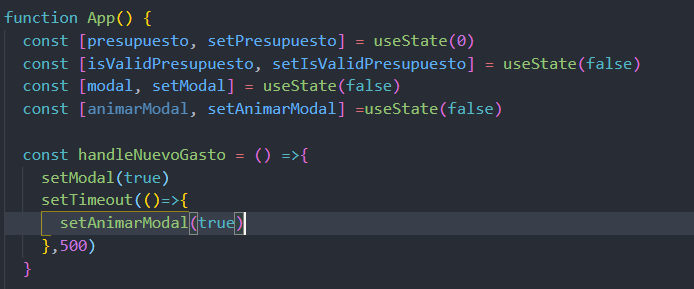
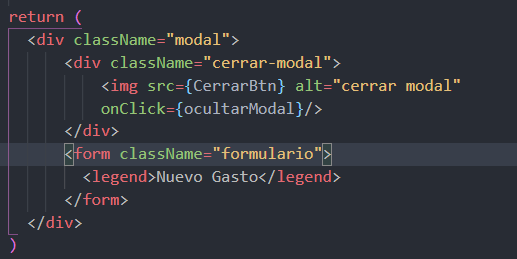
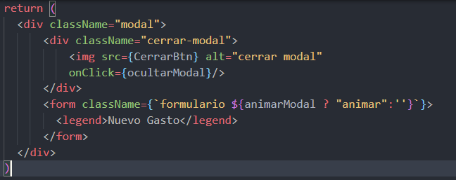
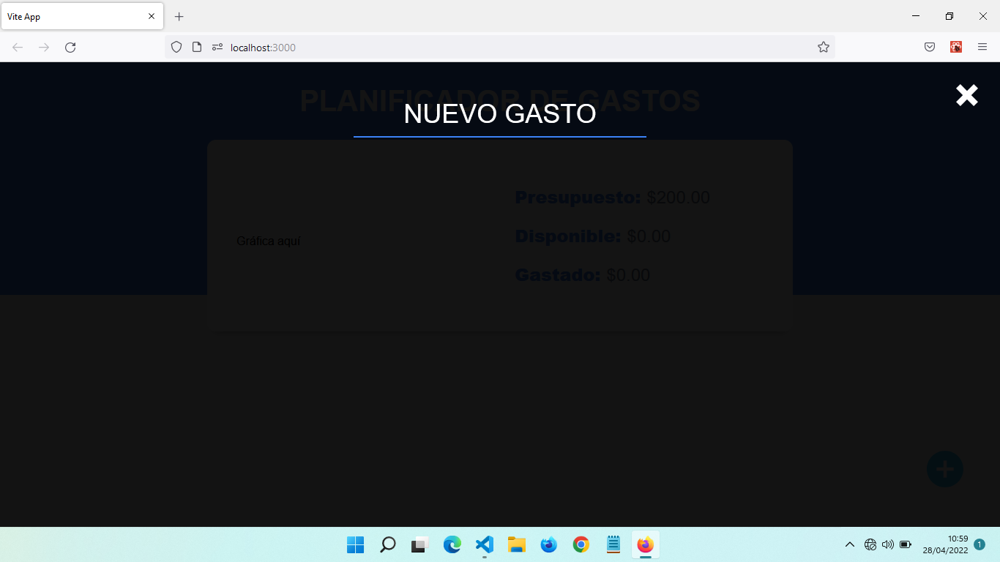
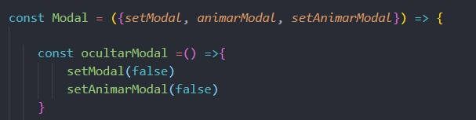
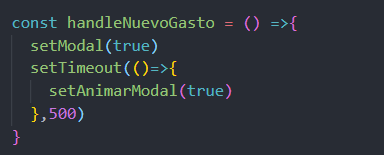
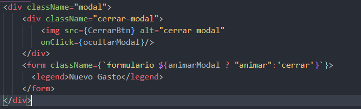

# Creando Animación Modal

- Añado un formulario al modal con la clase formulario, y un legend con nuevo gasto.
- No aparece en pantalla por el CSS
- El css tiene una clase modal.formulario con opacity:0 y otra modal.formulario.animar con opacity: 1
        - Por eso tiene esa animación de fade in. ¿Cómo se hace?
- Voy a incorporar un setTimeOut en handleNuevoGasto con 500 milisegundos
- Agrego un state para que cuando esté en true agregue la clase animar

- Al componente Modal le paso via props el animarModal para que sepa cuando cambió
~~~js

      {modal && <Modal 
                setModal={setModal}
                animarModal={animarModal}/>}
~~~

- Ahora la clase estática formulario no me sirve, la cambio a back ticks entre llaves para inyectar javascript

Si animarModal está en true, le agregas la clase animar, si no nada

- Ahora, al cabo de medio segundo aparece Nuevo Gasto 

- Pero ahora el state de animar se mantiene en true, con lo cual si cierro y vuelvo a abrir ya no hay animación
- Tengo que pasar setAnimarModal via props para añadirlo a ocultarModal

- Ahora pongo un setTimeOutpara en ocultarModal pero con la lógica al revés de handleNuevoGasto para que despues de medio segundo, el state de modal pasa a ser false 

- En lugar de desmontar el componente y ya, que eso hará que no haya transición, hay una clase predefinida que es .modal.formulario.cerrar con opacity:0

- Se la agrego para que en ese lapso de tiempo del timeout aparece el opacity y agrega la transición

En el próximo capitulo añadiré los campos restantes

