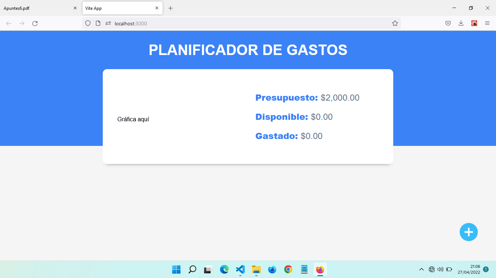
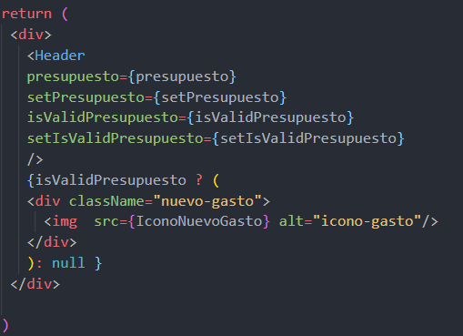

# Botón mostrar gastos

- El botón va a estar en el App.jsx, lo que debo hacer es importarlo

        import IconoNuevoGasto from './assets/img/nuevo-gasto.svg'

- Ahora lo coloco en un div con una etiqueta img así
~~~jsx

  return (
   

     <Header 
     presupuesto={presupuesto}
     setPresupuesto={setPresupuesto}
     isValidPresupuesto={isValidPresupuesto}
     setIsValidPresupuesto={setIsValidPresupuesto}
     />
     

       
     

   

  )

~~~

- El problema es que se muestra en la pantalla primera tambien y no debería
- Por ello uso el isValidPresupuesto en un ternario para que lo muestre si esta en true
- Se podría usar también && y quitar el null

Este botón abrirá un modal con Nuevo Gasto, Cantidad y Categoría
